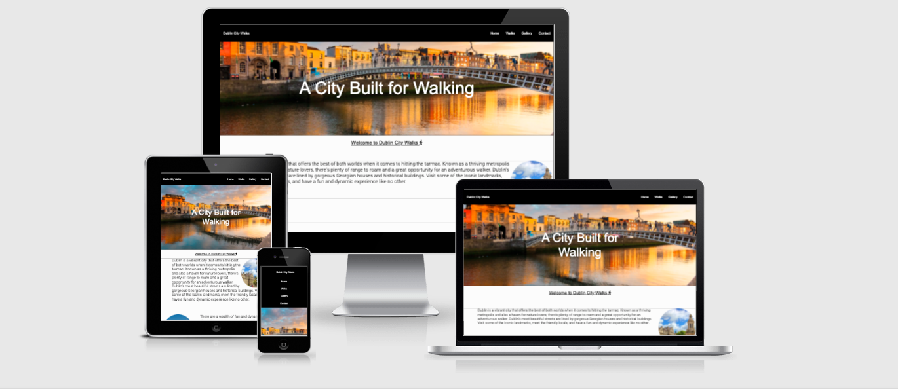

# Dublin City Walks

## Site Overview

The Dublin City Walks website is an information resource created for those who enjoy the leisurely pursuit of walking and who would also like to know a little bit more about the location to the best places for walking within the confines of Dublin City.
  

It is a website designed to be viewed by people of all ages and its use serves to provide historic and visually appealing places of interest, whilst also incorporating in the healthy activity of walking. It highlights a visual representation of what are deemed desireable locations to walk in Dublin City. 
  

The Walks page is the primary source that reflects a strong and appealing visual of Dublin City locations where enthusiasts would like to walk. Coupled with this, the page gives additional historical information and anecdotal content which site visitors can enjoy. There is also a Contact page where visitors can include their details to subscribe to a newsletter for further information on other walks within Ireland.
  

 

# Planning Stage

 

## Identifying a Target Audience

 

* People who enjoy walking.

* People who are interested in finding out more about various walking routes and trails in Dublin City.

* People who enjoy coupling a walking past-time with that of various interests in city landmarks and historical interests.

 

# User Stories

 

## First-time Visitors

* Users should have immediate information on the subject matter of the website.

* The site should be have the ability to be easily navigable for visitors to acquire information.

* The site should provide inspiration for a visitor who is interested in the subject matter.

* The site should allow visitors communicate easily with the creator of the site via a Contact page.

 

## Returning Visitors

* For returning visitors it would be good to have updated information on new walks.

* For returning visitors new images and information on new walks would be great to see.

 

 

# Design

 

## Colour Schemes

 

* For the colour schema of the website I largely drew from a personal aesthetic in an alarmingly painstaking fashion, mixing and matching colours that I felt coincided well off the palette. The body colourway proved to be the most regularly amended and I finally resolved on rgba(16, 35, 54, 0.692). I think this colour set well with the Images placed within the main body of the website, in particular the Walks page.

* Navbar links and Heading text in the Home page were offered the unadventurous, but stellar rgb(255, 255, 255). This worked well and in keeping with simple, understated but classic design.

* Hover options on navigation links and social media icons yielded a rgb(245, 73, 6) for good contrast.

 

## Font Families

 

* Font Families included Serif, Helvetica, Source Sans Pro for the Body. I felt that Serif complimented the unfussiness of the webpages, especially for navigation links and welcome text. It added a clarity and refinedness that the pages deserved. 

* Roboto was utilised for text information in the Walks page. This went well with the lightness in attitude of the Walks page. Roboto added to those descriptions, also complimenting the character of the walk descriptions.

  

# Features

## Navigation

 

   * The Navigation Bar is featured on all 4 pages of the website.

   * The top left-hand side of the page features the website Name: Dublin City Walks. There is no active link attached to this logo.

   * Active navigation links reside to the top right-hand side of the page. They are as follows: Home, Walks, Gallery, Contact. These link to 3 further separate pages in the website.

   * The links created give a good overview of what the website is conveying and creates a simplistic, clean view of how one should navigate the site. 

   * Prevailing colours for the Navigation bar were designed in a contrasting black and white *(Figure 1.1)*

   * A hover red option with a text decoration underline is present on all Navigation links on all pages *(Figure 1.2)*  

   * A hamburger menu was initially entertained and created, but the inclusion of JavaScripting felt it wouldn't be within the remit of Portfolio requirements. This would be an option for later Portfolio submissions.

  

   
   *Figure 1.1*
     

   
   *Figure 1.2*

  

## The Home Page, Images & Description

 

  * The Home Page consists of the quintessentially unmistakeable backdrop of an iconic landmark in that of the H'apenny Bridge. Plenty of feet have tread this bridge for centuries so it felt appropriate to make this a centrepoint image on the landing page.

  * The logo sentiment is reiterated and also an added textual sentiment is present to indicate that Dublin is an exciting city that is built for walking.

  * The image adopts a transform and zoom element which gives depth upon opening the page. 

  * The smaller images coupled with text give more than just a visual representation, plus it gives a taste of the history of Dublin when people partake walks around the city.

   

   

   

  ## The Walks Page

   

  * The Walks Page consists of a primary 40em image with an eye-catching text description of the best walks available to anyone who visits the site.

  * There is a varied amount of imagery depicting the landscape, but there is context to each location drawing from Irish literature to scenic vistas. This gives the reader a sense of not only the prospect of a nice walk, but an historical outlay of what's worth visiting in Dublin. 

  * Links at the base of the page give the visitor an option to visit the Gallery or Contact Page.

    

  ## The Gallery Page

   

  * The Gallery Page highlights a myriad of vistas and points of interest around Dublin City. It gives a nice visual of what visitors to the site could come to expect about this location.

  * Links at the base of the page give options for a reader to visit the Contact Page seamlessly.

    

  ## The Contact Us Page

   

  * The Contact Page is an essential part of the website whereby users can get in touch to ask more about the website and the content inside of it. In the case of this Contact Page it invites visitors to provide their e-mail details so they can subscribe to a newsletter.

    

  ## Footer

   

  * The footer 

    

  # Testing

  # Validation

   

  # Future Features

